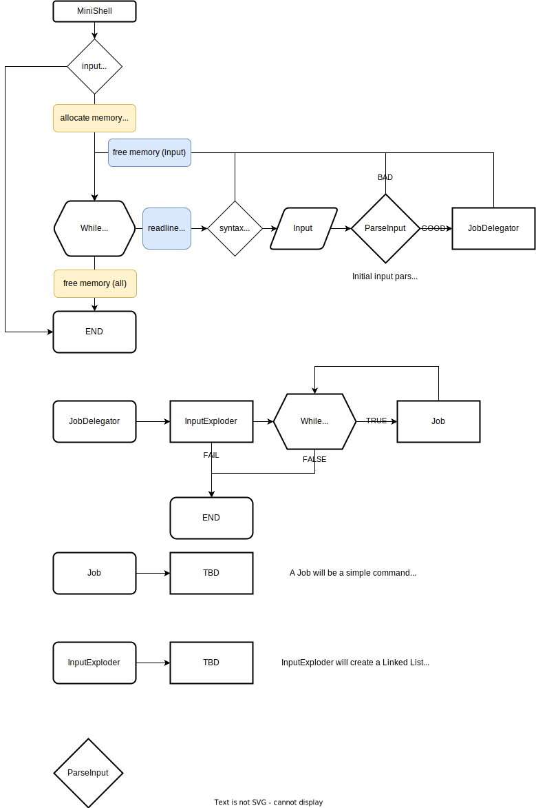

# 04_minishell
04_minishell

# Reference Information:
https://www.cs.purdue.edu/homes/grr/SystemsProgrammingBook/Book/Chapter5-WritingYourOwnShell.pdf

# Initial Flowchart Diagram

## Job Delegator Example Flowchart

## Job Flowchart

## Debug a Child process
    
    set detach-on-fork off
    set follow-fork-mode child
    
